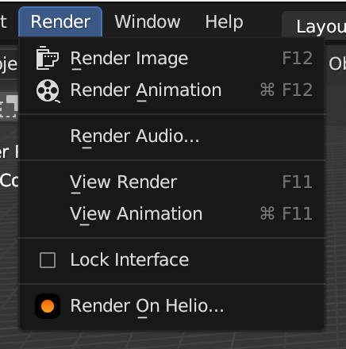

# Helio Cloud Rendering Blender Addon

## Installing

1. Make sure to have the latest [Helio client](https://helio.exchange/products/client) installed.
2. Download the latest `helio-blender-addon-VERSION.zip` from the [releases](https://github.com/helio/blender-addon/releases/latest) page.
3. In your Blender installation go to `Edit -> Preferences -> Addons -> Install...` and point to the downloaded zip file.
4. Enable the addon

There's now a new `Render on Helio` menu item in the `Render` menu which you can use to collect assets and send them to the Helio client.



## Development

Set up your local IDE/Editor to use the python interpreter installed with Blender.

```
# macOS Blender 3.4
/Applications/Blender.app/Contents/Resources/3.4/python/bin/python3.10
```

To run/test the addon, use `make run`.

## Release

To create a new release:
1. update the version number in `__init__.py`
2. create a new release with a tag (following semver). Important: It needs to be a GitHub release, a tag alone is not enough.
3. The GitHub action will automatically upload an appropriate release archive once the tag is there.

## Credits

Thanks to:
- [CGCookie](https://github.com/CGCookie/) for the [blender-addon-updater](https://github.com/CGCookie/blender-addon-updater)
- various StackOverflow posts
